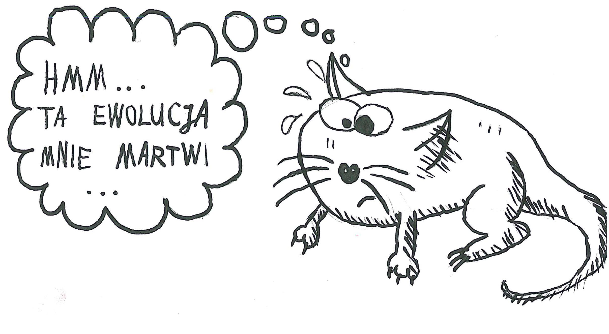
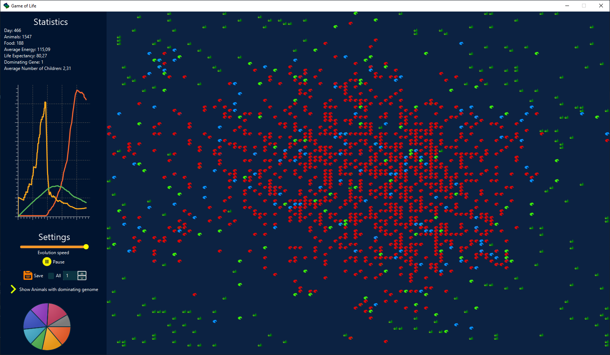

# Game of Life

Project is (more or less) strict implementation of guidelines (see links) which are based on description and illustrations prepared by Wojciech Kosior.
His inspiration was "Land of Lisp" by Conrad Barski, who in turn had been inspired by an article in "Scientific American" :-)

## Usage
- to run, type in root directory of a project `mvn clean javafx:run`
- to pause, press `P`
- to exit, press `ESC`

## Demo

## Links
- [description](https://github.com/apohllo/obiektowe-lab/tree/master/lab8)
